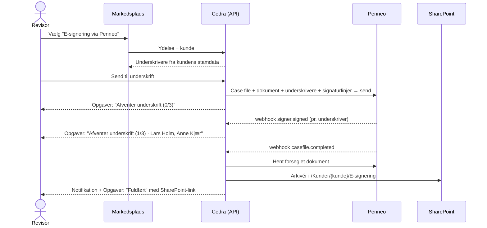
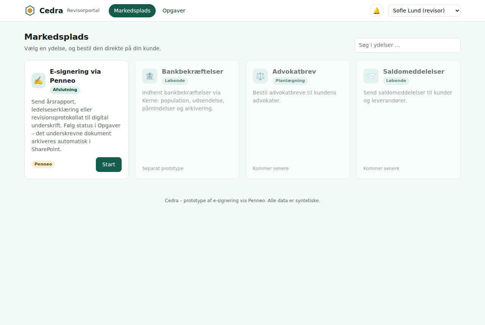
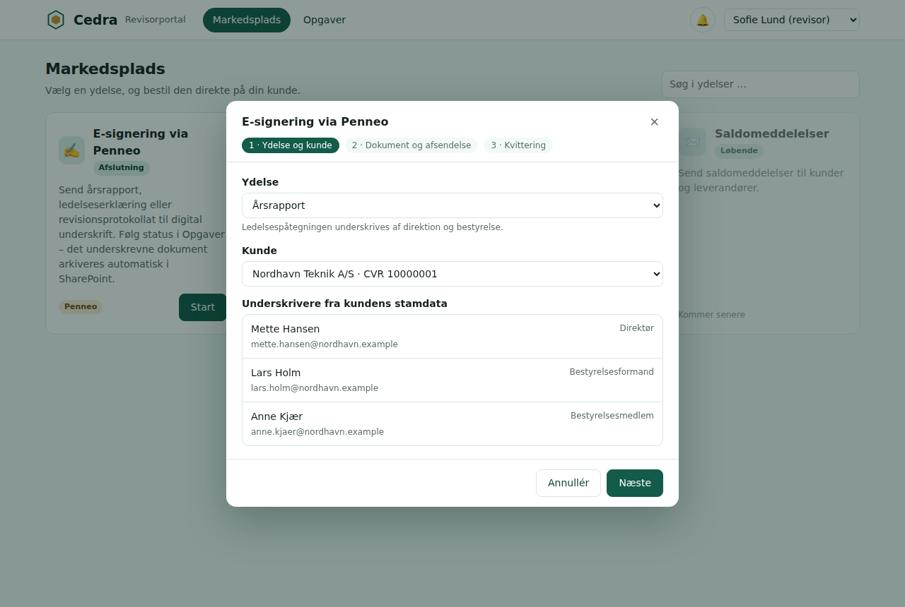
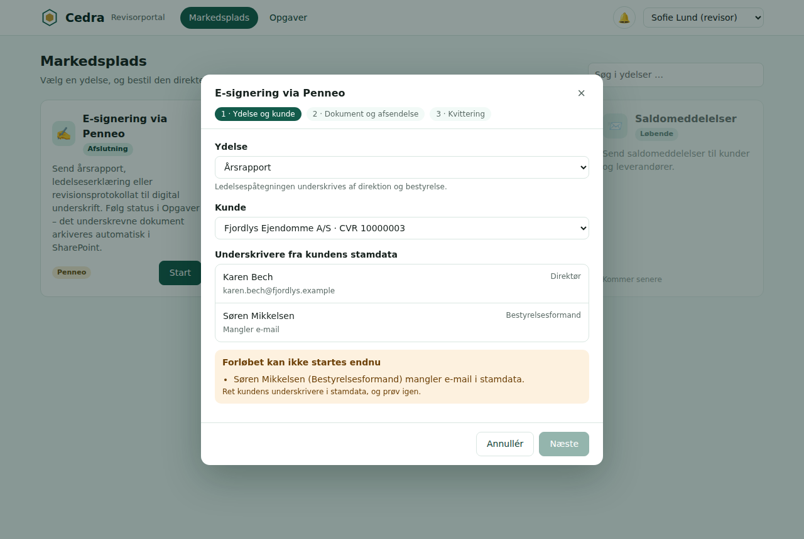
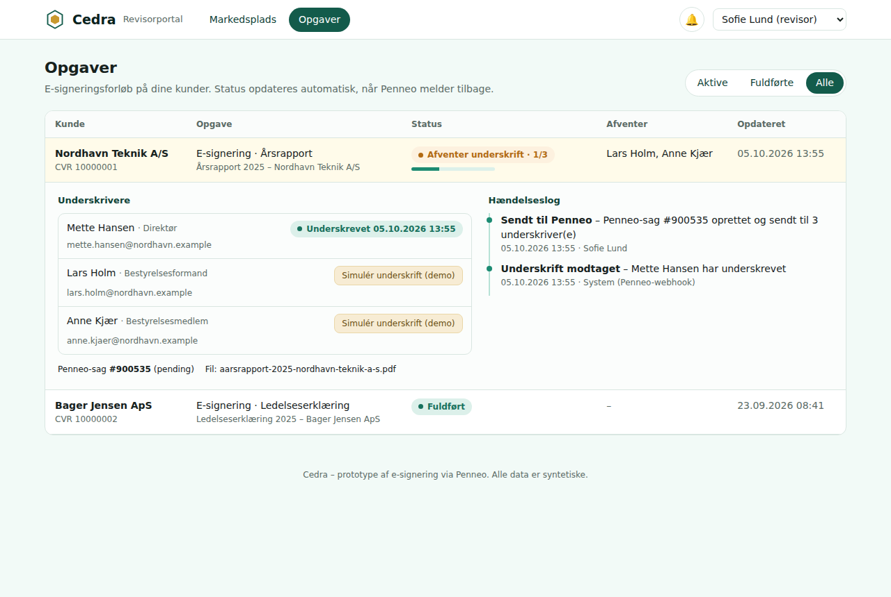
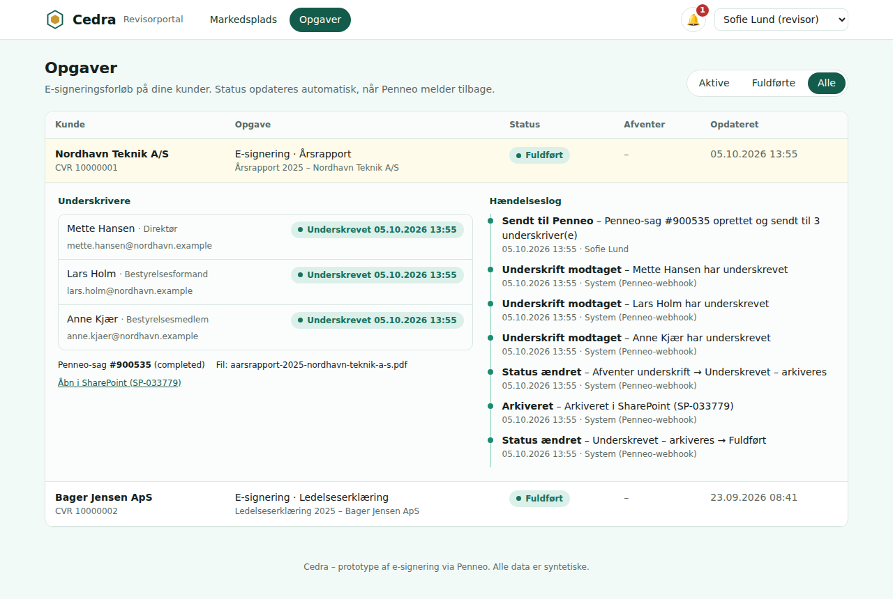

# Cedra E-signering via Penneo – workflowprototype

Et ultrasimpelt eksempel på at få dokumenter underskrevet via Penneo: revisor finder **E-signering via Penneo** på markedspladsen, vælger ydelse (fx *Årsrapport*) og kunde, får kundens underskrivere fra stamdata og sender til underskrift. Status følges i **Opgaver** ("Afventer underskrift (1/3)"). Når alle har underskrevet, arkiveres dokumentet i SharePoint, og revisor får besked. **Alle data er syntetiske.**

Prototypen følger samme mønster som [Bankbekræftelser](https://github.com/madkrig/test/tree/claude/pensive-archimedes-o4tspq): domæneregler uden I/O → services med transaktioner og append-only hændelseslog → udskiftelige adaptere (Penneo, SharePoint, notifikationer) → tynde API-ruter. Hver mutation returnerer `nextAction`/`nextOwner`.

## Flowet



## Skærmbilleder

| Markedsplads | Dialog: underskrivere fra stamdata |
|---|---|
|  |  |
| **Dialog: stamdata blokerer** | **Opgaver: afventer underskrift (1/3)** |
|  |  |



## Kom i gang

```bash
cd penneo-esignering
npm install            # kører også prisma generate
cp .env.example .env   # DATABASE_URL + PENNEO_MODE=mock
npm run setup          # opretter SQLite-databasen og indlæser startdata
npm run dev            # http://localhost:3000
npm test               # unit + integrationstests (separat prisma/test.db)
npm run typecheck
```

## Demo på 2 minutter

1. Åbn **Markedsplads** → **E-signering via Penneo** → **Start**.
2. Ydelse *Årsrapport*, kunde *Nordhavn Teknik A/S* → systemet viser Mette Hansen (direktør), Lars Holm (bestyrelsesformand) og Anne Kjær (bestyrelsesmedlem). Peter Juul er fratrådt og kommer ikke med.
3. **Næste** → upload evt. en PDF (ellers bruges et genereret demodokument) → **Send til underskrift**.
4. **Gå til Opgaver**: status *Afventer underskrift · 0/3*, afventer alle tre.
5. Klik **Simulér underskrift (demo)** ud for hver underskriver. Knappen spiller Penneos rolle og sender de samme webhooks, som Penneo ville sende, gennem den rigtige webhook-handler.
6. Efter den sidste: status *Fuldført*, link til SharePoint, og 🔔 viser en notifikation.

Vis også blokeringerne i dialogen: *Fjordlys Ejendomme A/S* (bestyrelsesformanden mangler e-mail) og *Bager Jensen ApS* + *Revisionsprotokollat* (ingen bestyrelse).

Brugervælgeren øverst til højre skifter mellem Sofie Lund og Martin Krogh. Revisorer ser kun egne kunder.

## Statusser

| Status | Vises i Opgaver | Afventer | Næste skridt |
|---|---|---|---|
| `AWAITING_SIGNATURES` | Afventer underskrift · 1/3 | Navnene på dem, der mangler | Penneo: `signer.signed` / `casefile.completed` |
| `SIGNED` | Underskrevet – arkiveres | System | Hent dokument fra Penneo → SharePoint |
| `SIGNED` + flag `archiveFailed` | Arkivering fejlede | Revisor | **Prøv arkivering igen** |
| `COMPLETED` | Fuldført | – | Dokumentet ligger i SharePoint |
| `REJECTED` | Afvist | Revisor | Afklar med kunden, start nyt forløb |

Overgangene er låst i `src/domain/e-signing/statuses.ts` (afventer → underskrevet → fuldført, eller afventer → afvist).

## Arkitektur

```
src/domain/e-signing/        rene funktioner: statusser, ydelseskatalog, underskrivervalg, Penneo-begreber
src/services/                use cases: igangsætning, webhooks, arkivering, notifikationer, eventlog, idempotens
src/services/adapters/       Penneo, SharePoint og notifikationer (mocks bag interfaces)
src/app/api/**               tynde route handlers (Zod-validering → service)
src/app/markedsplads, opgaver  skærmene
prisma/schema.prisma         datamodel
tests/unit, tests/integration  domænetests og API-flows via de rigtige route handlers
docs/                        Penneo-integration, API, antagelser
```

- **Penneo-integrationen:** [docs/penneo.md](docs/penneo.md) – hvilke Penneo-kald hvert trin svarer til, og hvad der skal på plads før en rigtig adapter.
- **API:** [docs/api.md](docs/api.md).
- **Antagelser og begrænsninger:** [docs/antagelser.md](docs/antagelser.md).

## Hvad er genbrugt fra Bankbekræftelser, og hvad er skåret væk

| Bankbekræftelser | E-signering |
|---|---|
| Seks hovedstatusser, to maskiner | Fire statusser, én maskine |
| Population, fire-øjne, påmindelser, T-10-eskalering | – (Penneo håndterer påmindelser) |
| Kerne udfører, revisor beslutter | Revisor starter, Penneo udfører, systemet arkiverer |
| SharePoint-arkivering af banksvar med integritetshash | Samme mønster for det forseglede dokument |
| Append-only eventlog, idempotency, `nextAction`/`nextOwner`, `DomainError` med recovery | Samme |
| Prototype-auth via `x-user-id`/cookie `cedra-user` | Samme |
